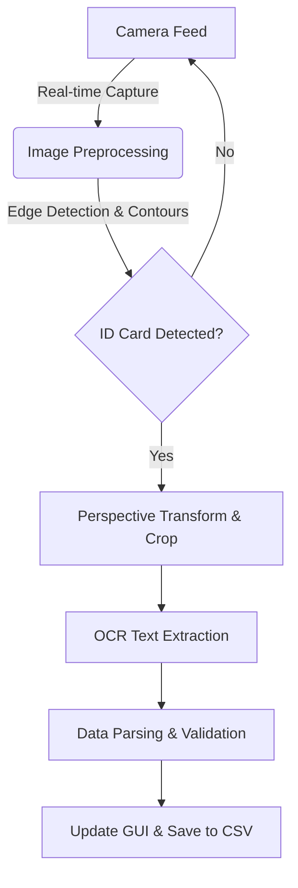

<div align="center">

# NomosID 🆔
### Computer-Vision Based Attendance Automation System

[](https://www.python.org/)
[](https://opencv.org/)
[](https://riverbankcomputing.com/software/pyqt/)
[](LICENSE)

<p align="center">
  <strong>Extract Identity • Automate Logging • Eliminate Errors</strong>
</p>

</div>

---

## 📖 Overview

**NomosID** is a robust attendance automation system designed to extract identity information directly from physical ID cards using Optical Character Recognition (OCR) and real-time image processing. 

By integrating a camera-based acquisition pipeline with advanced preprocessing algorithms, NomosID detects ID cards, isolates relevant data regions, and converts them into structured digital records instantly. This system eliminates the need for manual data entry, significantly reducing human error and enabling rapid attendance logging.

## ✨ Key Capabilities

* **👁️ Real-time Detection:** Automated ID card detection and image cropping from live camera feeds.
* **📝 OCR Extraction:** Extracts text fields (Name, ID Number, etc.) using PyTesseract.
* **⚡ Automated Logging:** Generates attendance records instantly upon successful scan.
* **🖥️ Desktop Control Interface:** A user-friendly PyQt GUI for monitoring the camera, validating scans, and managing records.
* **📂 Data Management:** Automatic export of attendance logs to CSV format for easy integration with Excel or databases.

## 🛠️ Technologies Used

* **Language:** Python
* **Computer Vision:** OpenCV (cv2), NumPy
* **OCR Engine:** PyTesseract (Google Tesseract-OCR wrapper)
* **GUI Framework:** PyQt (PyQt5/PyQt6)
* **Data Handling:** Pandas / CSV

## ⚙️ System Workflow



## 🚀 Installation

### Prerequisites

1. **Python 3.8+** installed.
2. **Tesseract-OCR Engine**:
* *Windows:* [Download Installer](https://www.google.com/search?q=https://github.com/UB-Mannheim/tesseract/wiki) and add it to your System PATH.
* *Linux:* `sudo apt-get install tesseract-ocr`
* *Mac:* `brew install tesseract`


### Setup

1. **Clone the repository**
```bash
git clone [https://github.com/yourusername/NomosID.git](https://github.com/yourusername/NomosID.git)
cd NomosID

```


2. **Install dependencies**
```bash
pip install -r requirements.txt

```


> **Note:** Your `requirements.txt` should include: `opencv-python`, `pytesseract`, `numpy`, `PyQt5`.


3. **Configure Tesseract Path (Windows Only)**
If Tesseract is not in your PATH, uncomment the line in the code setting the `tesseract_cmd`:
```python
# pytesseract.pytesseract.tesseract_cmd = r'C:\Program Files\Tesseract-OCR\tesseract.exe'

```


## 📸 Usage

1. Run the application:
```bash
python main.py

```


2. The GUI will open, displaying the live camera feed.
3. Place an ID card in front of the camera.
4. The system will automatically draw a bounding box around the card, capture the image, and extract the text.
5. Review the extracted data on the dashboard and check the `attendance.csv` file for the log.

## 🤝 Contributing

Contributions are welcome! Please feel free to submit a Pull Request.

